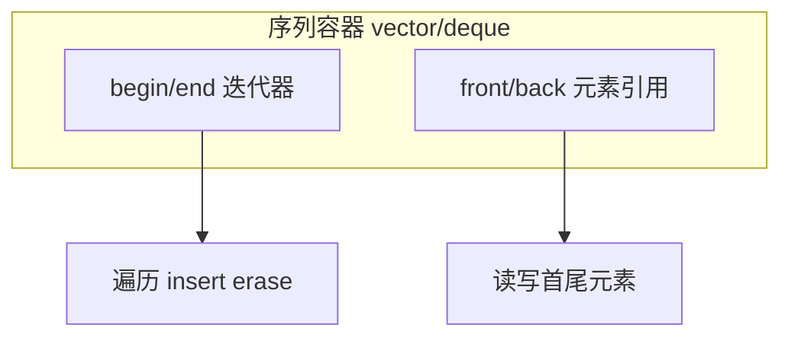

# Apollo Prediction 笔记

### 30 pages (0.2 seconds)



```
mermaid
flowchart TB   subgraph seq ["序列容器 vector/deque"]     begin["begin/end 迭代器"]     front["front/back 元素引用"]   end   begin --> iterOps["遍历 insert erase"]   front --> elemOps["读写首尾元素"]
mermaid flowchart TB   subgraph seq ["序列容器 vector/deque"]     begin["begin/end 迭代器"]     front["front/back 元素引用"]   end   begin --> iterOps["遍历 insert erase"]   front --> elemOps["读写首尾元素"]

## 相关笔记

[自动驾驶（主题索引）](../../../../index/MOC-autopilot.md)
[[Apollo-Prediction-笔记|Apollo Prediction 笔记]]
[[Apollo-3.0-编译运行|Apollo 3.0 编译运行]]
[[Apollo-6.0-安装|Apollo 6.0 安装]]
[[Apollo-Cyber-RT-框架|Apollo Cyber RT 框架]]
[[Apollo-预测模块结构|Apollo 预测模块结构]]
[[VSCode-调试-Apollo|VSCode 调试 Apollo]]
[[Cyber-RT-常用命令|Cyber RT 常用命令]]
[[VSCode-连接-Docker-调试|VSCode 连接 Docker 调试]]
