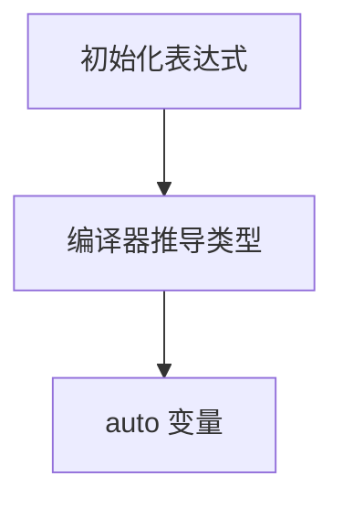

> 概念页：[[AStar-路径搜索|A* 路径搜索]]

# Apollo Cyber RT 介绍

Apollo Cyber​​ RT 是一个开源, 高性能的运行时框架，专为自动驾驶场景而设计。针对自动驾驶的高并发, 低延迟, 高吞吐量进行了大幅优化。本文介绍 Cyber RT 优势，开发工具以及常用术语。

## 优势

Apollo Cyber ​​RT 具有以下优势：

### 加速开发
*   具有数据融合功能的定义明确的任务接口，
*   一系列开发工具，
*   大量传感器驱动程序。
### 简化部署
*   高效自适应的消息通信，
*   具有资源意识的可配置用户级调度程序，
*   可移植，依赖更少。
### 为自动驾驶赋能
*   默认的开源运行时框架，
*   为自动驾驶搭建专用模块。
## 开发工具
Cyber RT 框架同时也提供了以下工具用来辅助日常开发，包括：
*   可视化工具 `cyber_visualizer`。详情参见 [使用 CyberVisualizer 查看原始感知数据](https://developer.apollo.auto/Apollo-Homepage-Document/Apollo_Doc_CN_6_0/%E4%B8%8A%E6%9C%BA%E4%BD%BF%E7%94%A8%E6%95%99%E7%A8%8B/%E5%AE%9E%E6%97%B6%E9%80%9A%E4%BF%A1%E6%A1%86%E6%9E%B6CyberRT%E7%9A%84%E4%BD%BF%E7%94%A8/%E4%BD%BF%E7%94%A8CyberVisualizer%E6%9F%A5%E7%9C%8B%E5%8E%9F%E5%A7%8B%E6%84%9F%E7%9F%A5%E6%95%B0%E6%8D%AE%E5%AE%9E%E8%B7%B5)。
*   命令行工具 `cyber_monitor` 和 `cyber_recorder`。详情参见 [使用 CyberMonitor 查看 Channel 数据](https://developer.apollo.auto/Apollo-Homepage-Document/Apollo_Doc_CN_6_0/%E4%B8%8A%E6%9C%BA%E4%BD%BF%E7%94%A8%E6%95%99%E7%A8%8B/%E5%AE%9E%E6%97%B6%E9%80%9A%E4%BF%A1%E6%A1%86%E6%9E%B6CyberRT%E7%9A%84%E4%BD%BF%E7%94%A8/%E4%BD%BF%E7%94%A8CyberMonitor%E6%9F%A5%E7%9C%8BChannel%E6%95%B0%E6%8D%AE%E5%AE%9E%E8%B7%B5) 和 [使用CyberRecorder播放数据包](https://developer.apollo.auto/Apollo-Homepage-Document/Apollo_Doc_CN_6_0/%E4%B8%8A%E6%9C%BA%E4%BD%BF%E7%94%A8%E6%95%99%E7%A8%8B/%E5%AE%9E%E6%97%B6%E9%80%9A%E4%BF%A1%E6%A1%86%E6%9E%B6CyberRT%E7%9A%84%E4%BD%BF%E7%94%A8/%E4%BD%BF%E7%94%A8CyberRecorder%E6%92%AD%E6%94%BE%E6%95%B0%E6%8D%AE%E5%8C%85)。这些工具需要运行在 Apollo Docker 环境内，且依赖于 Cyber RT 软件库。使用这些工具前，您需要通过如下方式来配置 Cyber RT 工具的运行环境：
`username@computername:~$: source /apollo/cyber/setup.bash`

## 常用术语
### Component
在自动驾驶系统中，模块（如感知, 定位, 控制系统等）在 Cyber ​​RT 下以 Component 的形式存在。不同 Component 之间通过 Channel 进行通信。Component 概念不仅解耦了模块，还为将模块拆分为多个子模块提供了灵活性。

### Channel
Channel 用于管理 Cyber​​ RT 中的数据通信。用户可以发布/订阅同一个 Channel，实现 P2P 通信。

### Task
Task 是 Cyber​​ RT 中异步计算任务的抽象描述。

### Node
Node 是 Cyber​​ RT 的基本组成部分。每个模块都包含一个 Node 并通过 Node 进行通信。通过在节点中定义 Reader/Writer 或 Service/Client，模块可以具有不同类型的通信形式。

### Reader/Writer
Reader/Writer 通常在 Node 内创建，作为 Cyber​​ RT 中的主要消息传输接口。

### Service/Client
除 Reader/Writer 外，Cyber​​ RT 还提供了用于模块通信的 Service/Client 模式。它支持节点之间的双向通信。当对服务发出请求时，客户端节点将收到响应。

### Parameter
参数服务在 Cyber​​ RT 中提供了全局参数访问接口。它是基于 Service/Client 模式构建的。

### 服务发现
作为一个去中心化的框架，Cyber​​ RT 没有用于服务注册的主/中心节点。所有节点都被平等对待，可以通过“服务发现”找到其他服务节点。使用 `UDP` 用来服务发现。

### CRoutine
参考协程（Coroutine）的概念，Cyber​​ RT 实现了 Coroutine 来优化线程使用和系统资源分配。

### Scheduler
为了更好地支持自动驾驶场景，Cyber ​​RT 提供了多种资源调度算法供开发者选择。

### Message
Message 是 Cyber​​ RT 中用于模块之间数据传输的数据单元。

### Dag 文件
Dag 文件是模块拓扑关系的配置文件。您可以在 dag 文件中定义使用的 Component 和上游/下游通道。

### Launch 文件
Launch 文件提供了一种启动模块的简单方法。通过在 launch 文件中定义一个或多个 dag 文件，可以同时启动多个模块。

### Record 文件
Record 文件用于记录从 Cyber ​​RT 中的 Channel 发送/接收的消息。回放 Record 文件可以帮助重现 Cyber​​ RT 之前操作的行为。

## 文档意见反馈
如果您在使用文档的过程中，遇到任何问题，请到我们在【开发者社区】建立的 [反馈意见收集问答页面](https://developer.apollo.auto/developer/index_cn.html#/forum)，反馈相关的问题。我们会根据反馈意见对文档进行迭代优化。

## 相关笔记

[自动驾驶（主题索引）](../../../../index/MOC-autopilot.md)
[[A-C++-实现(daancode)|A* C++ 实现（daancode）]]
[[A-算法-PythonC++-实现|A* 算法 Python/C++ 实现]]
[[A-算法-openset-澄清|A* 算法 openset 澄清]]
[[RRT-快速随机树|RRT 快速随机树]]
[[RRT-路径剪枝|RRT 路径剪枝]]
[[RRT-路径规划课程作业|RRT 路径规划课程作业]]
[[圆形障碍-A-路径(切线可见图)|圆形障碍 A* 路径（切线可见图）]]
[[Apollo-Cyber-RT-框架|Apollo Cyber RT 框架]] — _路径 / 运动规划_
