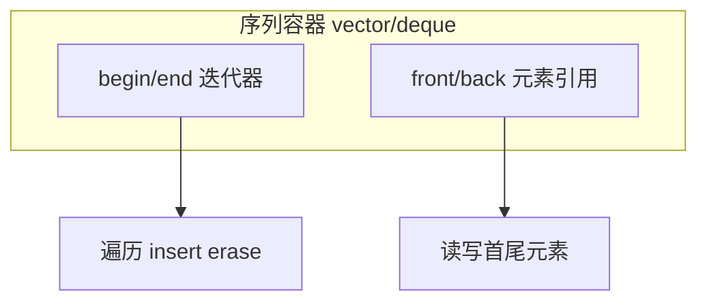

# 决策控制与运动规划综述

- 看前须知
- 1.介绍
- 2.路径规划
- 3.End To End DMAP
- 4.Behavior-Aware Motion Planning
- 4.1 Cooperation And Interaction
- 4.2 Game-Theoretic Approaches
- 4.3 Probalilistic Approaches
- 4.4 Partially Observable Markov Decision Processes
- 4.5 Learning-Based Approaches
- 5.VERIFICATION AND SYHTHESIS
- 6.待解决的问题
- 7.学习资源推荐
## 看前须知
本人方向为自动驾驶决策控制与运动规划（Decision Making And Motion Planning, DMAP），前段时间终于发完了里程碑式的文章，到现在科研路也是逐渐步入下一阶段了，想着当初入门的时候那种困难且没有方向的感觉，而且网上实在缺少对这方面知识简单易懂且全面的梳理，我觉得可以把我所学分享出来，供大家参考借鉴。需要注意的是：这些东西你完全可以从网上或者文献中获得，从这篇blog中了解信息的优势仅仅是帮你省去大把大把大把自己找文献梳理脉络的时间（对症下药的那种，而不是漫无目的的随意的文献），梳理出决策规划方向到底都有什么。并且我会讲许多比较常见的算法比如A*D*之类的。**因为这篇文章是针对入门者，基于我入门时的想法，我会尽量秉持着大白话的风格以方便理解，喜欢科研风格请直接略过本文去看其他SCI****这篇blog依托于我很久之前随笔性质的学习内容，所以在讲述DMAP时，你可能会看到一些网上的图。我自己东西我也会抛出来一些，参考文献需要的我会都给你们。**应广大联系我的朋友的需求，我已在各章节分享出对应的优质学习资源，**知乎有链接的我就直接放链接了，没链接的也给出了资源名字，找不到的朋友可以在评论区留言**。码了一万多字，各位如果觉得帮到你们了的话，麻烦点个赞吧，谢谢了。**

## 1.介绍
：当前自动驾驶汽车存在的三大类感知决策控制方法所示的决策控制方法由上至下依次为：sequential planning, behavior-aware planning, 以及end-to-end planning.sequential planning属于最传统的方法，感知, 决策与控制三个部分层次较为清晰；behavior-aware planning这种方法相比第一种，亮点在于引入人机共驾, 车路协同以及车辆对外部动态环境的风险预估；end-to-end planning这种方法基于DL, DRL技术，借助大量的数据做训练，获得从图像等感知信息到方向盘转角等车辆控制输入的关系，属于时下最热门的方法之一。本文将对上述三种方法的内容与遇到的问题以及已取得的成果做简要介绍，第二节将介绍sequential planning，这一节里会按照整个决策控制顺序讲述自动驾驶汽车的感知控制过程。第三节介绍端到端的自动驾驶，第四届介绍behavior-aware planning决策控制方法，第五节介绍安全性验证的方法，最后会简要总结一下前文所提到的待解决的问题。

## 2.路径规划
：sequential planning 的过程如所示为sequential planning 的过程，简要概括为路径规划->决策过程->车辆控制，本小结将要讲述的路径规划属于其中的第一步与第三步。在无人车的运动轨迹生成问题上，有直接轨迹生成法与路径-速度分解法两种，相比第一种，路径-速度难度更小，因此更加常用。路径规划可分为四大类：以PRM, RRT为代表的基于采样的算法, 以为A*, D*代表的基于搜索的算法，以β样条曲线为代表的基于插值拟合的轨迹生成算法，以及以MPC为代表的用于局部路径规划的最优控制算法。本小节将按照上述顺序逐一讲解：
：路径规划算法的效果图表2：路径规划算法优缺点
- 2.1基于采样的算法
1. 基本算法PRM与RRT的构建

：PRM效果图(1) PRM的构建[1] 1) 预处理阶段：对状态空间内的安全区域均匀随机采样ｎ个点，每个采样点分别与一定距离内的邻近采样点连接，并丢弃掉与障碍物发生碰撞的轨迹，最终得到一个连通) 查询阶段：对于给定的一对初始和目标状态，分别将其连接到已经构建的图中，再使用搜索算法寻找满足要求的轨迹容易看出，一旦构建一个PRM之后，可以用于解决不同初始, 目标状态的运动规划问题，但是这个特性对于无人车运动规划而言是不必要的。另外PRM要求对状态之间作精确连接，这对于存在复杂微分约束的运动规划问题是十分困难的(2) RRT的构建[2] 1） 树的初始化：初始化树的结点集和边集，结点集只包含初始状态，边集为空2） 树的生长：对状态空间随机采样，当采样点落在状态空间安全区域时，选择当前树中离采样点最近的结点，将其向采样点扩展（或连接）．若生成的轨迹不与障碍物发生碰撞，则将该轨迹加入树的边集，该轨迹的终点加入到树的结点集3） 重复步骤2），直至扩展到目标状态集中，相比PRM的无向图而言，RRT构建的是初始状态作为根结点, 目标状态作为叶结点的树结构，对于不同的初始和目标状态，需要构建不同的树。另外，RRT不要求状态之间的精确连接，更适合解决像无人车运动规划这样的运动动力学问题
2. 基于采样的算法所面临的问题与解决办法

几乎所有算法都有着几个相同的问题——求解效率与是否最优 解。PRM与RRT拥有概率完备性的原因在于其几乎会遍历构型空间 中所有位置，如中e所示。在提升求解效率方面，优化RRT的核心思想在于引导树向空旷 区域，即尽量远离障碍物，避免对于障碍物处的节点的重复检查，以 此提升效率，具体方法如下：
（1）均匀采样标准RRT算法对状态空间均匀随机采样，当前树中结点获得扩展的概率与其Voronoi区域面积成正比，所以树会向着状态空间的空旷区域生长，均匀充满状态空间的自由区域。文献[3]提出RRT-connect算法，同时构建两棵分别起始于初始状态和目标状态的树，当两棵树生长到一起时则找到可行解。Go-biaing[4]是指在随机采样序列中以一定比例插入目标状态，引导树向目标状态扩展，加快求解速度，提高求解质量。文献[5]提出启发式RRT算法（heuristic RRT），使用启发式函数增加扩展代价低的结点被采样的概率，这个函数要求计算树中每个结点的代价，但是在复杂环境中，代价函数的定义往往是很困难的，为解决这一问题，文献[6]提出f-biased采样方法，先将状态空间离散化为网格，再使用Dijkstra算法计算每个网格上的代价，这个网格所在区域的点的代价值都等于该值，以此构建启发式函数（2）优化距离度量距离用来度量构形空间（状态空间）中两个构形（状态）之间路径（轨迹）的代价，这个代价可以理解为路径的长度, 消耗的能量或是花费的时间，采用距离度量的原因在于辅助生成启发式代价函数，引导树的走向。但是实际操作时，在考虑障碍物的情况下，距离计算的难度是非常高的，运动规划中距离的定义采用类似欧氏距离的定义。文献[7]中给出了构型空间的加权距离表达式，即根据两个构型点的坐标, 状态，并为他们分配权重，以此构建加权距离表达式。然而这种距离表达式并不能完全正确反应两个构型之间的距离，因此带来较大的误差。文献[8]提出了RG-RRT （rechability guided RRT）可以消除不准确的距离对RRT探索能力的影响。RG-RRT计算树中结点的能达集，当采样点到结点的距离大于采样点到该结点能达集的距离时，该节点才有可能被选中进行扩展（3）降低碰撞检查次数碰撞检查是基于采样的算法的效率瓶颈之一，通常的做法是对路径等距离离散化，再对每个点处的构形作碰撞检查。文献[9]提出RC-RRT（resolution complete RRT）来降低靠近障碍物的结点获得扩展的概率，具体做法是对输入空间离散化，对于某个结点，其某个输入只能使用一次；若某个输入对应的轨迹与障碍物碰撞，则对该节点加上一个惩罚值，该惩罚值越高，该节点获得扩展的概率越小。文献[10]与文献[11]分别提出DD-RRT（dynamic domain RRT）与ADD-RRT（adaptive dynamic domain RRT），限制采样区域在当前树所在的局部空间，以防止靠近障碍物的结点反复扩展失败，提高算法效率（4）提升实时性Anytime RRT[12]是一种实时性较高的算法，它先快速构建一个ＲＲＴ，获得一个可行解并记录其代价。之后算法会继续采样，但仅将有利于降低可行解代价的结点插入树中，从而逐渐获得较优的可行解。Replanning[13]是另一种实时规划算法，它将整个规划任务分解为若干等时间的子任务序列，在执行当前任务的同时规划下一个任务。
（5）在解决最优性问题上主要有以下方法：
文献[14-16]根据随机几何图理论对标准PRM和RRT 做出改进，得到了具有渐近最优性质的PRM*, RRG和RRT* 算法。在状态空间中随机采样ｎ个点，并将距离小于r(n)的点连起来，就构成了随机几何图（random geometric graph，RGG）．渐近最优性要求r(n)满足：
r(n)=γ〖(logn/n)〗^(1/d)式中：γ与具体环境有关；ｄ 为状态空间维数。按照这一理念对标准PRM和RRT改造即得到PRM* 和RRG算法。在RRG基础上引入“重新连接”步骤，即检查新插入结点作为其临近点的父结点是否会使其临近点的代价降低，若降低，则去掉临近点原来的父子关系，将当前插入点作为其父结点，这就是RRT*算法。大量的结点连接和局部调整使得PRM*和RRT*的效率十分低下。文献[17]中提出了LBT-RRT算法，将RRG和RRT* 算法结合起来，文献[18]在PRM*的基础上做出改进，大大减少了结点连接的数量，并且可以获得弱渐近最优性，两种方法均可在获得渐进最优性的前提下，获取更高的效率。效率跟最优性不能同时得到最优，如果把算法对二者的取舍的比例当成一个参数，这个参数如果是动态的，对于算法最终的效果一定会好很多（联想到kalman滤波根据加速度计与陀螺仪控制直立车体角度，根据噪声大小来分配测量值与预测值的权重，最后效果不错），只是这个思想能不能用到效率跟最优性的动态权重分配的编写上是个问题，现在感觉写不了，想法有点乱，等日后能力提升了再考虑这个问题。由于搜寻最优解而带来的算法计算量增大，在对其进行效率提升时，除了前一节提到的方法，还有如下的方法：先用RRT*找到一个可行解，再在此基础上拓展解，诸如文献[19][20]。
- 2.2基于搜索的算法

解决运动规划问题的另一大类算法是启发性搜索算法，其基本思想是将状态空间通过确定的方式离散成一个图，然后利用各种启发式搜索算法搜索可行解甚至是最优解。这类算法具有解析完备性，甚至是解析最优性，该种类别算法现已比较成熟，大概算法分类如所示：状态格子简图基于搜索的算法的基础是状态格子，状态格子[21]是一种对状态空间离散化的手段，状态格子由结点（表示状态）和从该结点出发到达相邻结点的运动基元组成，一个状态结点可以通过其运动基元变换到另一个状态结点。这样，状态格子就将原来连续的状态空间转化为一个搜索图，运动规划问题就变成了在图中搜索出一系列将初始状态变换到目标状态的运动基元构建起状态格子后就可以使用图搜索算法来搜索最优轨迹
1. 基础算法Dijkstra, A*的构建

Dijkstra算法[22]遍历整个构型空间，找出每两个格子之间的距离，最后选择出发点到目标点的最短路径，其广度优先的性质导致效率很低，在该算法的基础上加入启发式函数，即所搜索结点到目标节点的距离，并以此为基础再次进行搜索可避免全局搜索带来的效率低下，这即为A*算法[23]，如下图所示，红色为搜索区域。
：A*与Dijkstra算法效果对比图
2. 基于搜索的算法所面临的问题与建议

与基于采样的算法相同，这种类别的算法也需要做效率与最优性的优化在提升效率上面，A*本身属于静态规划的算法，针对A*算法的延申有weighted A*[24]通过增加启发式函数的权重进一步引导搜索方向向这目标节点进行，搜索速度很快，但是容易陷入局部极小值，无法保证全局最优解对于运动的车辆来说，使用A*的衍生算法D*（dynamic A*）[25]可大幅度提升效率，同样以动态规划为基础的还有LPA*[26]，该算法可以处理状态格子的运动基元的代价是时变的情况，当环境发生变化时可以通过对较少数目节点的重新搜索规划出新的最优路径，在LPA*的基础上开发出D*-Lite[27]可以获得与D*同样的结果，但是效率更高。在进行最优化解的探寻时，ARA*[28]是在Weighted A* 基础上发展出的具有Anytime性质的搜索算法，它通过多次调用Weighted A*算法且每次调用就缩小启发式函数的权重，这样算法可以快速求出可行解，通过引入集合INCONS使得每次循环可以继续使用上一次循环的信息，对路径做出优化，逐渐逼近最优解。在兼顾算法效率与最优性的问题上，Sandin aine等提出了MHA*算法[29]，引入多个启发式函数，保证其中有一个启发式函数在单独使用时可以找到最优解，从而通过协调不同启发式函数生成的路径代价，可以兼顾算法的效率和最优性。DMHA*[30]在MHA*的基础上在线实时生成合适的启发式函数，从而避免局部最小值问题。

A*还有其他的一些变种算法，M*[31]是专门进行多机器人运动规划的算法，R*[32]是由A*结合随机采样而来的算法，可以一定程度上避免局部最优。
- 2.3基于插值拟合的算法

基于插值拟合的算法可被定义为：根据已知的一系列用于描述道路图的点集，通过使用数据插值与曲线拟合的方式创造出智能车将行驶的路径，该路径可提供较好的连续性, 较高的可导性。具体的方法如下：
Dubins曲线[33]和Reeds and Sheep(RS)曲线[34]是连接构形空间中任意两点的最短路径，分别对应无倒车和有倒车的情况。它们都是由最大曲率圆弧和直线组成的，在圆弧和直线连接处存在曲率不连续，实际车辆按照这样曲线行驶时必须在曲率不连续处停车调整方向轮才能继续行驶。回旋线[35]的曲率与曲线长度成正比关系，即路径的曲率与曲线长度成线性关系，它可以用作直线到圆弧之间的过渡曲线，从而改造Dubins曲线和RS曲线，实现曲率连续性，比较有代表性的是CC-Steer[36]，适用于低速下的运动规划。多项式插值曲线[37][38][39]是最常用的一种方法，它可以通过满足结点的要求来设定多项式系数，并且获得较好的连续可导性，四阶多项式常用于纵向约束控制，五阶多项式常用于横向约束控制[37]，三阶多项式也被用于超车轨迹中[40]。样条曲线具有封闭的表达式，容易保证曲率连续性。β样条曲线[41]可以实现曲率连续性，三次Bezier曲线[42]可以保证曲率的连续性和有界性，并且计算量相对较小。η^3曲线[43]是一种七次样条曲线，它有着很好的性质：曲率连续性和曲率导数的连续性，这对于高速行驶车辆是很有意义的。
- 2.4基于最优控制的算法

将基于最优控制的算法归在路径规划中，主要是因为其中的MPC可以进行局部的路径规划以进行避障，除此之外，MPC主要的作用是进行轨迹跟踪，其所考虑的问题除了必要的动力学, 运动学约束以外，未来还应考虑舒适性, 感知信息的不确定性[45], 车间通信的不确定性[46]，并且在局部轨迹规划时还可以将驾驶员纳入控制闭环[38][44]。对于以上所提到的不确定性问题与将驾驶员纳入控制闭环将在第四节讨论。**关于MPC的学习，主要从优化理论与工程实践两个方面入手**。**对于前者**，推荐Dimitri P. Bertsekas的Convex Optimization Algorithms（需要一定的英语水平），James B. Rawlings的Model Predictive Control：
Theory, Computation, and Design. 中文领域刘浩洋老师的最优化书个人觉得相对清晰易懂。**对于后者，**首先龚建伟老师的那本无人驾驶MPC书强推了，老版书里的demo有问题，不过都在新版里解决了。

MPC所使用的预测模型有很多种：诸如卷积神经网络, 模糊控制, 状态空间等等，其中用的最多的为状态空间法。MPC可简要表述为：满足必要的动力学, 运动学等等约束的情况下，通过数值手段（一般为数值手段，因为模型太过复杂，传统的变分法等解析方法不再适用）求解模型的最优解，该最优解即为状态方程的控制量，如方向盘转角等等，并将控制量作用在车模上以获得要求的状态量，如速度, 加速度, 坐标等等。通过上述描述可知，MPC的关键在于模型的建立与模型的求解，如何等效简化模型的建立以及提升求解的效率是重中之重。在不同的控制输入下车辆会走不同的轨迹，每一条轨迹都与之对应一个目标函数值，无人驾驶车辆会通过求解算法找出最小目标函数值对应的控制量，并将其作用在车上，如下图所示：
为了降低建模难度，文献[47][48][49]使用人工势能场模型进行建模，人工势能场的基本思想类似于电场，道路上的障碍物类似于电场中与场源相异电荷极性的电荷，具体效果如下图所示。障碍物（动态, 静态）处的势能更高，无人车将向低势能位置前进。
：势能场简图文献[50-51], [15-18]提出了提升MPC求解效率的办法

## 3.End To End DMAP



```
mermaid
flowchart TB   subgraph seq ["序列容器 vector/deque"]     begin["begin/end 迭代器"]     front["front/back 元素引用"]   end   begin --> iterOps["遍历 insert erase"]   front --> elemOps["读写首尾元素"]
mermaid flowchart TB   subgraph seq ["序列容器 vector/deque"]     begin["begin/end 迭代器"]     front["front/back 元素引用"]   end   begin --> iterOps["遍历 insert erase"]   front --> elemOps["读写首尾元素"]如所示，以上所介绍的所有方法均属于第一种，传统的感知, 决策, 控制分层的方法，而第三种end to end方法就如图上所显示的一样，“一步到位”。该网络在实车控制逻辑中的位置如下：
端到端的方法通常采用深度学习或者深度强化学习进行。end to end方法输入到输出的映射有两种，一种是输入图像等感知信息输到出方向盘转角等控制量，另一个是感知信息到车模的状态量，如速度, 坐标等，二者均需要大量的数据做支撑，通常在做网络训练时，会将图像进行随机平移旋转等操作，以此进行数据扩充。**关于学习类算法（监督非监督, 强化等），推荐**大家看吴恩达的教学视频，b站自搜即可。关于机器学习的相关教材，可以说是种类非常的多了，在这里放一个**曾经我的导师给我的机器学习导论**（还有个小故事，当时他给我这本书的时候是在跟我强调：“什么机器学习不学习的，搞了这么多年不还是传统的优化方法那一套吗？”，说完让我自己去看这本书，这本书讲的确实**深入浅出且全面**，让我产生了时代也没进步多少的感觉）。除了这本书，因为看过b站上周志华的机器学习课，所以也用过他的教材，但是最开始入门的时候没咋看懂，感觉适合中级水平的人用。
Caltagirone在文献[52]中通过构建卷积神经网络，来构建从激光雷达点云信息, GPS-IMU惯性导航信息到路径规划的映射，该方法可将采集到的数据自动标号（supervised learning），并且每周进行一次训练。
NVIDIA的研究院[53]通过构建深度卷积神经网络，来达到从车辆前端摄像头信息到方向盘转角的直接映射，经实验认证，该方法可以较好的通过碎石路, 施工路，并且智能车可以在夜间光线不好时行驶。
Gurghian在文献[54]中通过装在车辆两侧下方的摄像头获得详细清楚的道路信息，通过端到端的形式获得车辆在道路上的横向位置。同样，Chen在文献[55]中使用神经网络的方式获得诸如航向角, 坐标等可解释性比较强的状态量。以上二者的end to end方法均需要将输出结果送入控制器进行车辆控制。
Xu在文献[56]中使用了大规模的驾驶视频数据来训练fully convolutional long short-term memory network，该方法输出结果既可以是诸如左转右转的离散行为，又可以是诸如转向轮转角的连续行为。
文献[57]提出了一种基于深度强化学习的具有社会意识的避障方法，该方法通过构建对称神经网络可以通过mutiagent场景中直接学习具有社会意识的行为表现。
虚拟场景永远与实际场景有差距，因此通过虚拟场景训练的自动驾驶车辆需要做出针对这个差距的应对策略，为此需要估计神经网络（贝叶斯网络）的不确定性，然而Recent ensemble, , bootstrap, 以及 Monte Carlo dropout methods并不能准确的给出不确定性的大小。为此，文献[58]提出了一种方法，用于评估该不确定性，并在风险较大时选择取消end to end控制，转而进行传统的分级控制。
在训练强化学习网络时，不可能进行实车训练，一般都是进行仿真测试，通过仿真测试不仅可以获得大量的碰撞数据，还可以获得虚拟场景内的实际关系以便于训练reward function。Wolf在文献[59]中使用Deep-Q-Network获得感知信息到转向轮的映射，在测试时他们发现，对于描述车辆在道路上的位置信息时，使用车辆对道路中线的偏移角等状态量可以提升算法的整体效果。文献[60]提出了一种提升虚拟场景真实度的方法，先将仿真设备中的图像输入segementation network进行分类，再通过生成式网络将其结果生成为更加接近现实的场景。
针对连续空间，Lillicrap在文献[61]提出了基于DRL网络，使用梯度策略训练的actor-critic以及model-free算法，该算法在仿真测试时取得较好效果。

## 4.Behavior-Aware Motion Planning
Behavior-Aware Motion Planning中文名为行为预警式运动规划，如中第二行所示。该方法相比两外两种特点在于将决策规划过程升级为交互式过程，包括驾驶员-驾驶车辆，驾驶车辆-外部环境。研究这种方法的目的在于将外部环境的不确定性纳入决策规划当中，以此提高自动驾驶车辆行驶安全性。在研究过程中将不考虑V2X技术的辅助加持。
本节将讲述研究中所用到的四类方法：cooperation and interaction（协同与交流）, games-theoretic approaches（博弈论）, probalistic approach（概率方法）, partially observable markov decision process（隐马尔可夫）, learning based approaches（机器学习）。
当自动驾驶车辆遇到突发状况，或是情况变得十分紧急，车辆会自动停止，这一行为被称为freezing-robot problem[62]，如果此时车辆不停止而是继续前进的话，那么很有可能遇到碰撞的危险。
在处理车辆遇到上述问题时的不确定性问题时，通常选择以下三个方法：
(1) 对外部环境进行更好的动态建模，文献[63]将预测的外部环境的未来的状态也纳入到模型中，以此降低不确定性，然而文献[62]指出，就算是完全知晓外部事物的运动状态，也仍然无法完全阻止freezing-robot problem的发生。
(2) 建模时将外部事物对车辆的反应当作约束条件[64]，然而该方法需要假定可以完全预测知晓外部事物，直观上来理解，过度的信任模型也将带来巨大的打击（那么信任还要不确定性干嘛）。
(3) 将车辆与外部的事物看作为一体，使其具有相同的分布，如概率分布[62], 价值函数分布。
文献[65]中给出了cooperation and interaction方法的定义，文献[66]站在协同合作的角度上，将这种协同车辆行为分为车车之间的通信协同的两个维度。
在控制算法中，通常情况下都是假定外部事物，如其他车辆，都是按照最小化其代价函数方法进行控制，评价其利益的手段则是一个cost函数或者reward函数或者utility函数。然而除了上述控制方法外，另外一种则是构建在最大似然估计或是最大后验概率的角度上，来求某一函数的极值。同样都是求评价函数函数的最值，但是两种方法有所不同。举例说明：第二种方法在遇到外来车辆时，先采取一个行动，随后对外来车辆进行建模，根据其行为来最大化自己的reward值。这种方法与在cooperation and interaction中提到的（2）有一个类似的缺点，就是建模的过程也就代表着对外部车辆间接的控制过程。
在建立interaction型的model时，算法复杂度与agent的数量成指数型增长，因此提高求解效率就变得更加的重要，最简单的方法就是根据agents运动情况，将行动空间离散化，然后搜索整个空间以获得可选的行动[65]。而在搜索这种数据空间时，有很多种高效的方法，文献[67]提出一种tree-type structure搜索方法，然而这种tree的大小也是随着agents呈指数型增长。
为了获得更加高效的算法，文献[68]提出了Monte Carlo search树搜索方法。文献[69]中假定跟随车辆的行为由其跟随的车辆决定，基于这种假设构建的算法复杂度与agents的数量之间仅呈二次关系。
文献[70]中将Stackelberg game的思想融入建模过程，这个思想是：领队的车辆采取的行动是基于其跟随车辆做出最恶劣行为，这里领队与跟随只是相对关系，对于每辆车均实行该方法。与决策树的方法相比，这种算法的负责度仅与agents的数量呈线性关系，但实际上决策树算法要优于该方法。
- 4.3 Probalilistic Approaches
这个方法就是跟字面表达的一样了，其实其他几种方法或多或少都是基于概率来构建算法的Wei在文献[71]中针对高速路进口处车辆合流的情景提出了一种，基于Markov决策过程的算法，该算法为要合流的两辆车提供了一个可行的policy集合，两车根据自己的代价函数，从集合中选取最优的policy即可，在这个方法中Wei选用了Bayes模型来进行社会行为的建模，比如：某车加速则代表其要抢入，减速则代表让行。
Werling在文献[72]中也提出了一种针对合流路口的路径规划方法。在对环境的reaction进行建模时，可以使用intelligent driver model，这是一个面向城市交通与高速路的车辆跟随连续模型，该模型从微观的角度来描述交通流中单车的纵向位置, 速度等，同时也是因为考虑其它车辆的状态，如加速度等，并将其加入到自己的代价函数中，而获得一定的协同能力。Hoermann在文献[73]中使用粒子滤波来估计该模型的行为参数，如最大加速度, 期望加速度等，根据此方法所得到的后验概率密度将被用于状态的更新。
Dong在文献[74]中使用概率图来估计外部车辆的行为，这种方法描述起来比较简单，就是根据其所观测到的信息来生成具有最大概率的行为文献[62]则是使用高斯过程来预测外部agents的运动轨迹以上简称POMDP，它是probilistic方法的一个分支，隐马尔可夫决策过程可以将其它agents的意图纳为自己的隐变量，文献[75]中提出了将其他车辆的驾驶意图作为隐变量的POMDP，POMDP中也包含着exploration（信息采集过程）与exploitation（progress to goal）的权衡问题，文献[76]中使用这一方法实现了无人驾驶车辆在城市道路中的驾驶POMDP社区关注offline建模，offline意味着想要获得最优的模型，但这使得算法运行起来耗时巨大的，对于自动驾驶汽车来说是无法接受的。为了提升效率，可使POMDP仅预测目前可到达的状态，进行规划轨迹时只规划个大概，而不是规划详细轨迹文献[77]中应用tree-based的方法进行policy evaluation，文献[78]提出了一种针对城市道路的实时多策略估计滚动时域控制，它通过POMDP预测其它物体的轨迹，结合非线性MPC规划出安全路径。
Brechtel在文献[79]中提出了一种针对感知信息不完全这个问题的平衡exploration与exploitation的方法.
文献[80]则是提出了一种无参数的强化学习来快速获得PODMP的近似最优解，然而这个方法的泛化能力比较差。
如上图所示为学习类算法最原始的分类，前面提到过的深度学习属于机器学习中的神经网络加深版（除此之外没啥区别），深度强化学习是将神经网络中的个别函数用强化学习的方式来学。无监督学习主要用在感知部分，决策控制部分的应用更多的是另外三类，以及他们的结合。**关于强化学习（深度强化学习）的入门级学习视频给大家推荐以下内容**：
我曾经做的工作是MPC与RL结合的研究，**用过的满意的教材是Bertsekas的书**：
Vallon在文献[81]中使用SVM来进行换道策略的决定，使用的特征是相对位置, 相对速度，换道策略决定后会通过MPC来进行局部路径规划。Vallon在文献[81]中使用SVM来进行换道策略的决定，使用的特征是相对位置, 相对速度，换道策略决定后会通过MPC来进行局部路径规划。
Lenz在文献[82]中使用神经网络训练了一个高斯混合模型，特征包括车辆当前, 过去的状态，道路形状等。全连接层比循环神经网络表现更好，也比4.3中提到的intelligent driver model好。
文献[83]中对高速路的驾驶方式仿真，其算法展示了MDP决策过程的巨大潜力，文献[84]在其基础上进一步提升了算法质量。
逆向强化学习IRL也被称为逆向最优控制，它可以为强化学习提供通常难以表述的reward函数，并且还不易发生过拟合，RL在此基础上在寻找最优的policy。
Ziebart在文献[85]中使用了IRL进行决策控制，maxmium-entroy IRL是比较出名的一种方法，文献[86][87][88]中利用这个方法进行了考虑社会意识与人类表现的运动规划，文献[89]中则使用其进行具有优先级的自适应导航。
Maximun margin planning是其延伸，文献[90]中用这个方法来为在非结构化道路上运行的机器人进行导航，文献[91]则用这个方法来学习自动驾驶的方法策略。
文献[92]设计了一种框架，使得IRL可以将expert的风险灵敏度纳入考虑之中，该框架使用了一个线性的算法来推断expert的风险量级。
文献[93]使用maxmium-entroy deep IRL网络极大程度的发挥了深度全卷积网络在描述驾驶行为的代价模型时的能力。
文献[94]证明了生成式对抗网络的有效性，并将其延伸到循环策略的优化问题上，IRL与RL结合使用效率比较低，而生成式对抗网络可以直接从数据中得到policy，这一方法可以保证在较长时域内提供快速的行为反应。

## 5.VERIFICATION AND SYHTHESIS
对于以上的所有方法生成的算法均需要很好的评估其安全性，文献[95]指出，评估一辆车安全需要数百万的里程，这需要十年的时间来完成。对于仿真测试来说，不论怎么优化，总是跟现实生活有所差距，因此就需要一个比较好的方法框架来给出绝对性的安全性证明，这也就是本节要讨论的问题。
文献[96]中提出了针对低复杂度任务，如自适应巡航, 单车车载网络等的synthesis方法，然而该方法计算效率十分低下。
相比之下，formal verification要高效一点，通常在分布式系统中，model checking常被用来进行formal verification，它通过对建立的模型的状态空间进行完全的检查，来判断该系统是否满足要求，文献[97]中加州理工大学用这个方法来进行软件模块间的状态一致性检查，以及为自适应巡航做安全性检查。
文献[98]在进行conservative linearization时使用reachability analysis来进行在线检查，并使用zonotopes作为集合表示，同时从数据库中查询应对紧急情况的操作。在线检查要求要有对外部环境事物的概率表示，这极大地增加了算法的复杂度。
文献[99]中提出了通过可达性分析来检查运动规划结果的可执行性。
除了在线检查以外，文献[100]提出了建立某地的道路模型库，这一方法可以较好的适用于城市道路的控制器与网络的检查，但是也有一个缺点，那就是它并未考虑到所有可能发生的行为。
文献[101]通过使用传统手段，如 short-term memory solvers解决了深度神经网络的安全验证问题。
文献[102]指出了现在面临的五个对于AI的验证性问题：复杂环境的建模；系统的建模；系统重要属性的详细解释；向量化操作；对于训练所需要的数据的定量化描述。

## 6.待解决的问题
日后需要考虑的问题除了一直都存在的算法的效率与建模的完备性以外，还有对驾驶安全的考虑，具体如下：
（1） 所建立的车辆运行模型应该更加贴近实际，现有摩多大部分只是将其简化为2自由度自行车模型，并且应逐步加入舒适性约束（2） 从路径规划的角度来看，可以通过HMI将驾驶员纳入闭环控制中（3） 更好地将环境的不确定性纳入到决策控制算法中去（4） 亘古不衰的提升算法求解效率（5） 提升算法的泛化能力

### *
### 7.学习资源推荐
从投稿开始到现在，一直有想入门的朋友加我要合适的学习资料，今天得空了所以打算写这一章，按照之前找我的人的需求，**给大家捋一下学习路线，分享一波我所收藏的资源。**目前在所有来找我的人里，咨询路径规划相关内容的人最多，因此**这次更新主要针对路径规划的相关资源进行推荐。**首先，甭管入门那个领域，有一个通用的学习脉络重点就是：**工程, 理论以及视野三驾马车齐头并进**。以入门路径规划为例，**工程**指的是了解各路径规划算法内容，这部分我在博客里已经详细的讲过了，但是光看肯定不够，最好是一边从广度上了解各算法内容，一边从深度上深入学习各算法细节（这些东西都是可以触类旁通的，所以不用因为算法多而害怕，因为大部分差不多）。**理论**指的是了解支撑这些算法运算数学原理以及这些算法产生的原因（数学视角），这部分我在博客里面没讲，因为很复杂，有兴趣的可以给我留言，我之后再梳理一遍。**视野**指的是了解路径规划在科研以及企业的主要应用，手段分别为科研文献以及成果报告等等。
工程, 理论以及视野相辅相成，三个位面最好是一起进行，但是对于有些人来说可能无法一上来就接受数学公式推导，对于这部分朋友可以先从工程角度出发，尝试自己去复现一下诸如A* RRT等等规划算法，然后从中文文章入手了解这些基础算法目前的研究现状（变种会有许多，阅读的过程是你积累自己方向与idea的过程）。等你了解清楚了这些算法的套路后，比如A*之类的启发式算法无非就是自己定义了两类函数（反应引力与斥力）然后迭代求最小值，这与势场法有啥本质不同？**路径规划就这？！**的时候**，**再来看背后的数学原理让自己冷静一下即可**。**那我们接下来就从这三个角度给大家推荐一些资源：

### 1.工程
关于路径规划领域的算法，从我的博客里面也能看出来是非常的多的（其实我也没完全讲完），当前没见过那个特别靠谱全面的教程，但是书籍还是有的，比如龚建伟老师的NMPC运动规划，从理解运动规划的思维以及NMPC方法层面上来说还是很不错的。链接如下：

### 2.理论
路径规划的底层数学理论主要是”最优化理论“”矩阵理论“”数值分析“，构建目标函数与约束条件同时求极值来得到最优控制量（路径）这个套路来自于”最优化理论“；在求解最优控制量时大家常见的牛顿法, 最速下降法等等这些数值求解方法，本质来自于数值求解代数等式方程，属于”数值分析“；求解过程中所见到的导数雅可比矩阵, 判断条件中的向量范数等等，本质就是把一维数值求解放到了高维，升维的方式由“矩阵理论”研究。下面给出相应资源：
最优化理论：
很温柔讲得也很好很细致的一个老师，推荐给想深入优化理论分析的朋友。
矩阵理论：
MIT的Gilbert Strang老爷子，牛的我就不提了，应该有不少人认识他，b站上还有他白头发之后的链接(上面第二个)，但是内容较难，适合作为第一个的进阶版。
数值分析：
工程与理论结合，老师讲的很好，当你遇到关于某个数值求解算法具体是怎么实现的，为什么保证算法收敛要调xxx参数的问题时，可以来看看他的讲解。（只是课程分的不够细致，需要耐心找找，内容还是很全的）

### 3.视野
这个部分主要是通过阅读科研文献以及报告来获取，文献在下面会细说，报告的话可以关注b站的中国汽车工程协会：

## 写在最后
以上的内容为比较接地气的总览，因为DMAP属实庞大，一篇文章里难以全部说出细节，但是在大面上我已经尽量的概括了，出于篇幅限制有一部分没有说。如果您只是想对DMAP有个大致的了解的话，那么我觉得上面的讲述能让您了解个皮毛，如果您还想要了解更多的话，请给我正向反馈，我可能之后会发更加深入的文章。

### 目前已对行为预测+路径规划（4.1 4.3 4.4 4.5）的内容进行了扩展补充，详细请见我的其他blog
### 如果您有何需求：例如想要这篇blog内涉及的参考文献，或者想要与我讨论, 咨询问题，请加我qq425505120，微信15830891508，并且标明来意，如：''想要DMAP参考文献''， ''咨询问题''。
另外，如果您还需要以下图片内的分类文章，也可以私信我，我都可以给您。图片里这些文章跟本blog所包括的文章重叠率非常小，并且这些都是我已经阅读完，在pdf内加有很多概括描述以及重点的文章，还是很新手友好的。

### 在算法方面的内容包括以LSTM为代表的RNN系列神经网络，以MPC, 模糊控制为代表的优化类控制算法，以隐马尔科夫, 动态贝叶斯为代表的基于策略的算法。除此之外还有很多kalman filter, particle filter，RL等等经典或者新的算法。
### 在内容上面包括：单车决策控制的行为预测与轨迹规划, 运动控制，多车决策的集中式, 分布式协同控制, 人机共驾
### 在侧重点中包括：注重动力学稳定性, 节能减排, 交通法规, 舒适性, 行车安全性等
另外有单独区分出来的近半年DMAP领域的**最前沿研究**，这部分适合有一定基础的朋友阅读。

### 以上，能看到这篇文章的应该都是科研狗，走这条路很辛苦，希望大家可以互相帮助，坚持下去！（图侵删）

## 相关笔记

[自动驾驶（主题索引）](../../../../index/MOC-autopilot.md)
[[Dubins-曲线简介|Dubins 曲线简介]]
[[Dubins-路径|Dubins 路径]]
[[Frenet-坐标系|Frenet 坐标系]]
[[Lattice-规划算法|Lattice 规划算法]]
[[四元数理解|四元数理解]]
[[地图表示|地图表示]]
[[时空联合规划|时空联合规划]]
[[自适应巡航-ACC-Adaptive|自适应巡航 ACC]]
